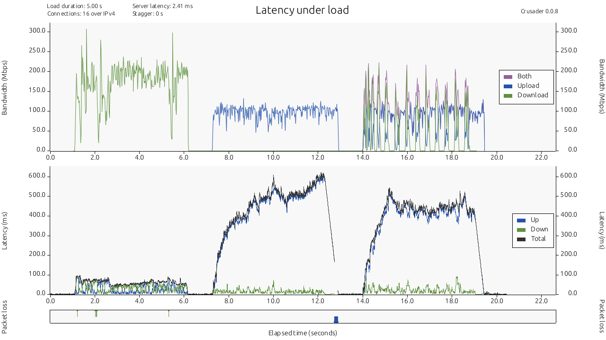
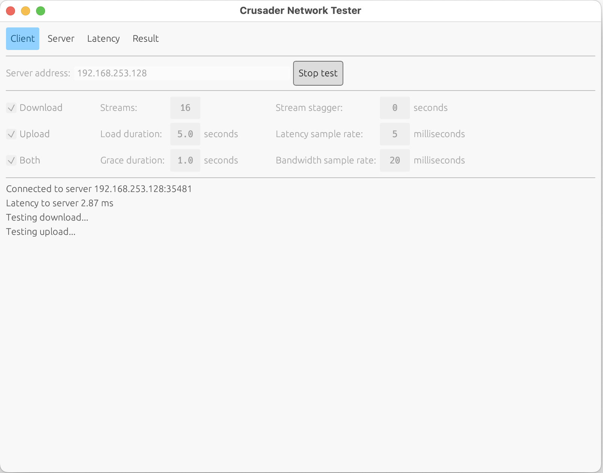

# Crusader Network Tester

The Crusader Network Tester measures network rates and latency
while downloading and uploading data.
It produces plots of the traffic rates,
latency and packet loss.

A test run requires two separate computers,
both running Crusader:
a **server** that listens for connections, and
a **client** that initiates the test.

Client and server talk on TCP and UDP port 35481.

## Current Status

The current version of Crusader is 0.0.9.

## Setup

To build all binaries:

```sh
cd src
cargo build --release
# executables are placed in src/target/release
```

## Crusader Server

To host a Crusader server, on the _server machine,_ run:

```sh
cd src/target/release
./crusader serve
```

## Crusader Client
To start a test run, on the _client machine,_ run:

```sh
cd src/target/release
./crusader test <server-ip>
```

The client produces a `.png` file showing charts (below)
as well as a `.crr` file with the raw data.
The top plot shows:

* Download traffic rates for five seconds
* Upload traffic rates for five seconds
* Bi-directional traffic rates for five seconds.
Note that the purple plot is the instantaneous
sum of the download plus upload.
* A quiet band before and between each burst of traffic

The lower plot shows the corresponding latency.
_(What could be said about the significance of the green and blue latency plots?)_

At the very bottom, green and blue marks show
places where packet loss occurred.



## Graphical interface

The build process also creates a binary with a
graphical interface that incorporates the server,
the client, and allows you to interact with results.
To use it, run the following command.
Enter the command below and click
**Start test** in the resulting window.

```sh
cd src/target/release
./crusader-gui 
```



Click the **Result** tab to see a chart similar to the one above.


