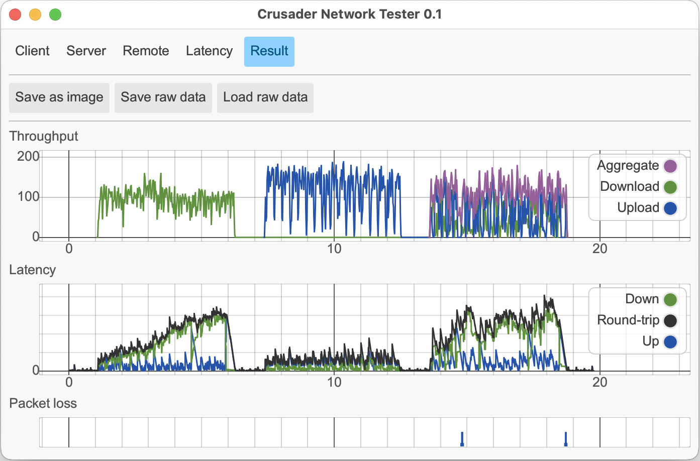

# Crusader Network Tester



[](https://github.com/Zoxc/crusader/releases)

The **Crusader Network Tester** measures network rates and latency
in the presence of upload and download traffic.
It also incorporates a continuous latency tester for
monitoring background responsiveness.
It produces plots of the traffic rates,
latency and packet loss.
Crusader only uses TCP and UDP ports 35481 for its tests.

**Pre-built binaries** for Windows, Mac, Linux,
and Android are available on the
[Releases](https://github.com/Zoxc/crusader/releases) page.

**Status:** The latest Crusader release is shown above.
  See the [CHANGELOG.md](./CHANGELOG.md)
  file for details.

## Crusader GUI

A test run requires two separate computers,
both running Crusader:
a **server** that listens for connections, and
a **client** that initiates the test.

The Crusader GUI incorporates both the server and
the client and allows you to interact with results.
To use it, download the proper binary from the
[Releases](https://github.com/Zoxc/crusader/releases) page
then open it.

The window below opens.
Enter the address of another computer that's
running the Crusader server, then click **Start test**.
When the test is complete, the **Result** tab shows a
chart like the second image below.
(An easy way to run the server is to start the Crusader GUI
on another computer, then choose the **Server** tab.)


The Crusader GUI has four tabs:

* **Client tab**
  Runs the Crusader client program. 
  The options shown above are described in the
  [Command-line options](#command-line-options) section.

* **Server tab**
  Runs the Crusader server, listening for connections from other clients

* **Latency tab**
  Continually tests the latency to the selected
  Crusader server until stopped.

* **Result tab**
  Displays the result of the most recent client run

## Understanding the Result Tab


A Crusader test creates three bursts of traffic.
By default, it generates five seconds each of
download only, upload only, then bi-directional traffic.
Each burst is separated by several seconds of idle time.

The Crusader Result tab displays the results of the test with
three plots (see image above):

* The **Throughput** plot shows the bursts of traffic:
green is download (from server to client),
blue is upload, and
the purple line is the instantaneous
sum of the download plus upload.

* The **Latency** plot shows the corresponding latency.
Blue is the (uni-directional) time from the client to the server.
Green shows the time from the server to the client (one direction).
Black shows the sum from the client to the server
and back (bi-directional).

* The **Packet Loss** plot has green and blue marks
that indicate times when packets were lost.

## Command-line options

**Usage: crusader test [OPTIONS] \<SERVER>**

**Arguments:** \<SERVER>

**Options:**

* **`--download`**
          Run a download test
* **`--upload`**
          Run an upload test
* **`--both`**
          Run a test doing both download and upload
* **`--port <PORT>`**
          Specifies the TCP and UDP port used by the server
          [default: 35481]
* **`--streams <STREAMS>`**
          The number of TCP connections used to generate
           traffic in a single direction
          [default: 16]
* **`--stream-stagger <SECONDS>`**
          The delay between the start of each stream
          [default: 0.0]
* **`--load-duration <SECONDS>`**
          The duration in which traffic is generated
          [default: 5.0]
* **`--grace-duration <SECONDS>`**
          The idle time between each test
          [default: 1.0]
* **`--latency-sample-rate <MILLISECONDS>`**
          [default: 5.0]
* **`--throughput-sample-rate <MILLISECONDS>`**
          [default: 20.0]
* **`--plot-transferred`**
          Plot transferred bytes
* **`--plot-split-throughput`**
          Plot upload and download separately and plot streams
* **`--plot-max-throughput <BPS>`**
          Sets the axis for throughput to at least this value.
          SI units are supported so `100M` would specify 100 Mbps
* **`--plot-max-latency <MILLISECONDS>`**
          Sets the axis for latency to at least this value
* **`--plot-width <PIXELS>`**
* **`--plot-height <PIXELS>`**
* **`--plot-title <PLOT_TITLE>`**
* **`--latency-peer <LATENCY_PEER>`**
          Specifies another server (peer) which will
          also measure the latency to the server independently of the client
* **`-h, --help**`**
          Print help (see a summary with '-h')
          
## Building Crusader from source

Use [pre-built binaries](https://github.com/Zoxc/crusader/releases)
for everyday tests.
To develop or debug Crusader, use the commands below
to build all three binaries.
Executables are placed in `src/target/release`

```sh
cd src
cargo build --release
```

## Running Crusader from the command line

See also the
[command-line options](#command-line-options) section.

### GUI Program

This command starts the GUI program.

```sh
cd src/target/release
./crusader-gui
```

### Crusader Server

To host a Crusader server, run this on the _server machine:

```sh
cd src/target/release
./crusader serve
```

### Crusader Client

To start a test, run this on the _client machine_:

```sh
cd src/target/release
./crusader test <server-ip>
```

## Troubleshooting

* Crusader requires that TCP and UDP ports 35481 are open for its tests.
  Check that your firewall is letting those ports through.

* Create a debug build by using `cargo build`
  (instead of `cargo build --release`).
  Binaries are saved in the _src/target/debug_ directory

* To get the git commit hash of the current checkout,
  use `git rev-parse --short master`

* I sometimes see this message: 
`Warning: Load termination timed out. There may be residual untracked traffic in the background.` 
  
  Should I be concerned? No. That may happen due to the TCP termination being lost or TCP incompatibilities between OSes. It's likely benign if you see throughput and latency drop to idle values after the tests in the graph. 
