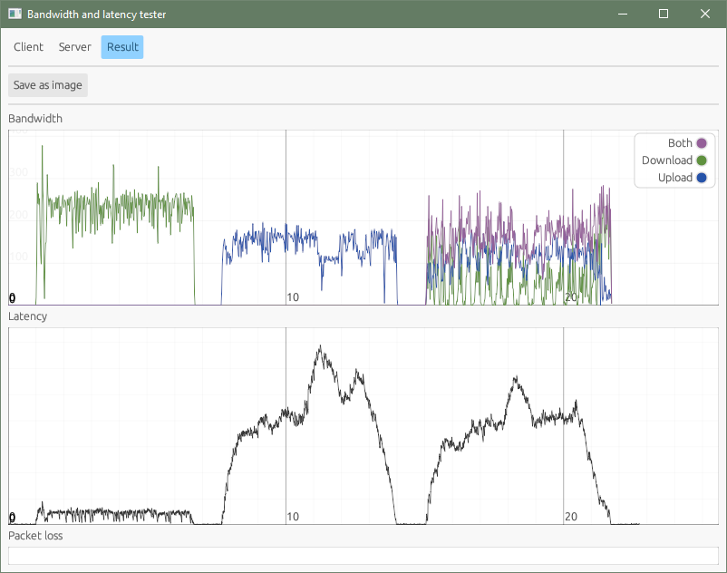

# Network bandwidth and latency tester

## Setup

Run `cargo build --release` to build the executables which are placed in `target/release`.

## Command line usage

To host a server run:
```sh
tool serve
```
It uses TCP and UDP port 30481.


To do a test run:
```sh
tool test <server-host>
```
This produces an graph output file named `plot.png`.


## Graphical interface

There is also a binary with a graphical interface allowing you to use a client, a server and interact with results.

