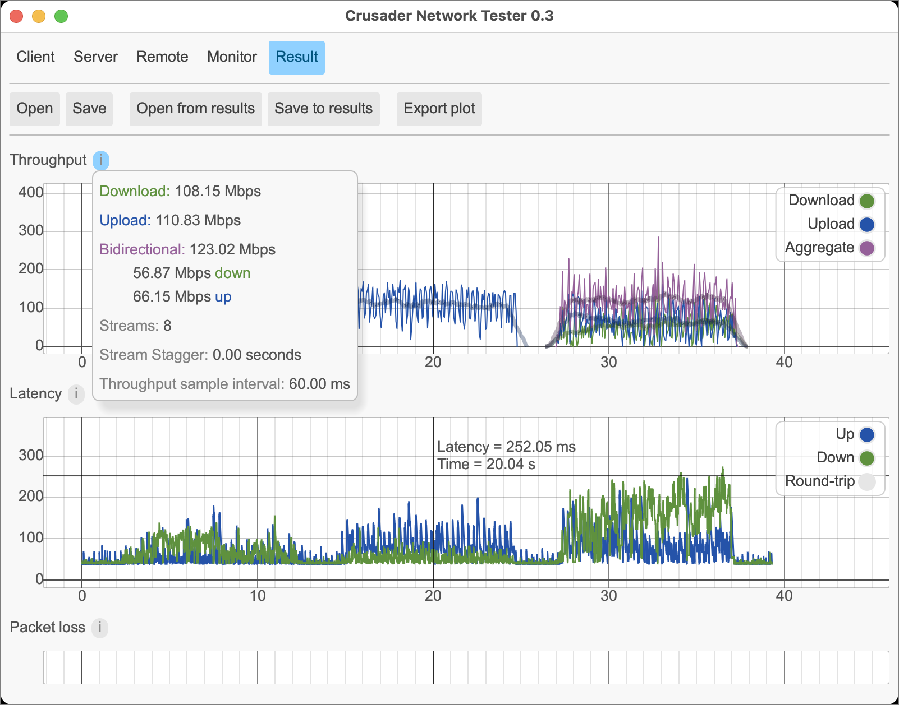

# Understanding Crusader Results

The Crusader GUI provides a compact summary of the test data.
Here are some hints for evaluating the results.

## Result window

Crusader tests the connection using three bursts of traffic.
The Throughput, Latency, and Packet loss are shown in the charts.
In the image above notice:

* Hovering over a chart shows crosshairs that give the throughput
  or latency of that point in the chart.
  In the screen shot above, the Down latency
  peaks around 250 ms.
* Hovering over, or clicking the ⓘ symbol opens a window that gives
  a summary of the statistics.
  See the description below for more definitions of the values.
* Clicking a legend ("color") in the charts shows/hides that chart.
  In the screen shot above, the Latency's "Round-trip" legend has been clicked,
  hiding the round-trip chart, and showing only the Up and Down values.

## Numerical Summary Windows

The Crusader GUI displays charts showing Throughput, Latency, and Packet loss. The ⓘ symbol opens a window showing a numerical summary of the charted data.

### Throughput

* Download - Average throughput (total data received divided by the elapsed time) during the Download portion of the test
* Upload - Average throughput during the Upload portion of the test
* Bidirectional - Sum of the Download and Upload throughputs during the Bidirectional portion of the test. Also displays the Download and Upload throughputs.
* Streams - number of TCP connections used in each direction
* Stream Stagger - The delay between the start of each stream  
* Throughput sample interval - Interval between throughput measurements

### Latency

Crusader smooths all the latency samples over a 400 ms window.
The values shown in the window display the maximum of those smoothed values.
This emphasizes the peaks of latency.

* Download - Summarizes the round-trip latency during the Download portion of the test.
  Also displays the measured one-way delay for Download (from server to client)
  and Upload (client to server)
* Upload - Summarizes the latency for the Upload portion of the test
* Bidirectional - Summarizes the latency for the Bidirectional portion of the test
* Idle latency - Measured latency when no traffic is present.
* Latency sample interval - Interval between latency measurements

### Packet loss

* Download - Summarizes packet loss during the Download portion of the test
* Upload - Summarizes packet loss during the Upload portion of the test
* Bidirectional - Summarizes packet loss during the Bidirectional portion of the test 
