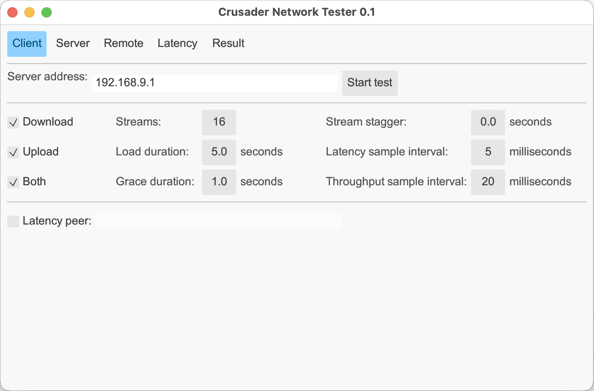
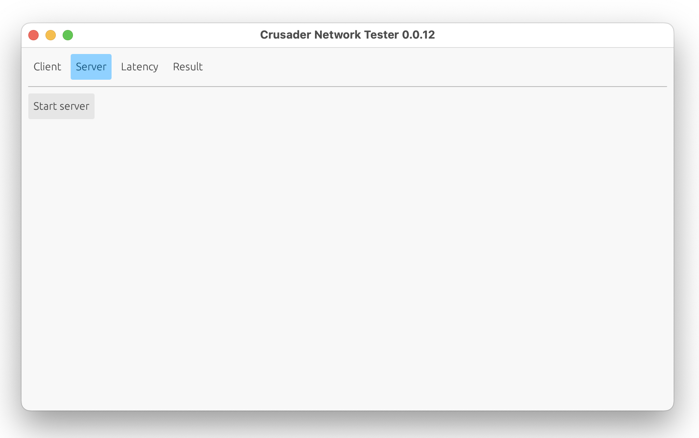
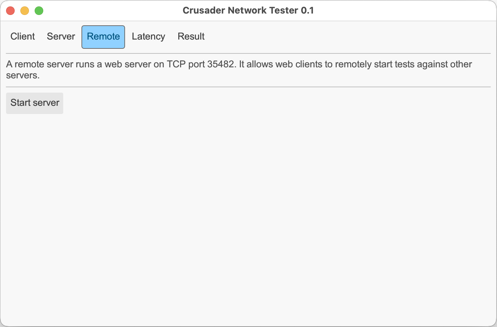
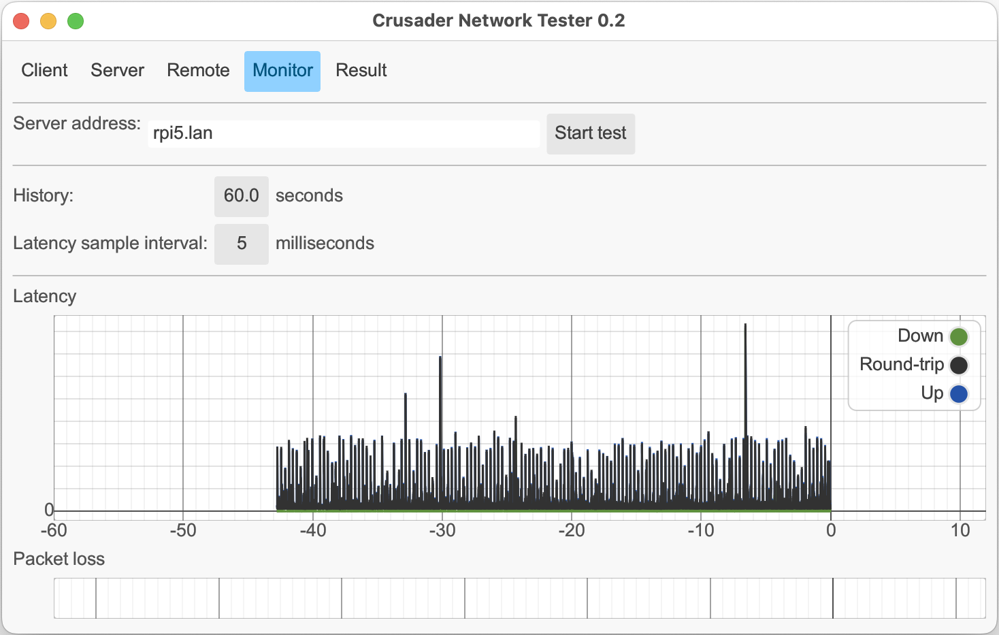
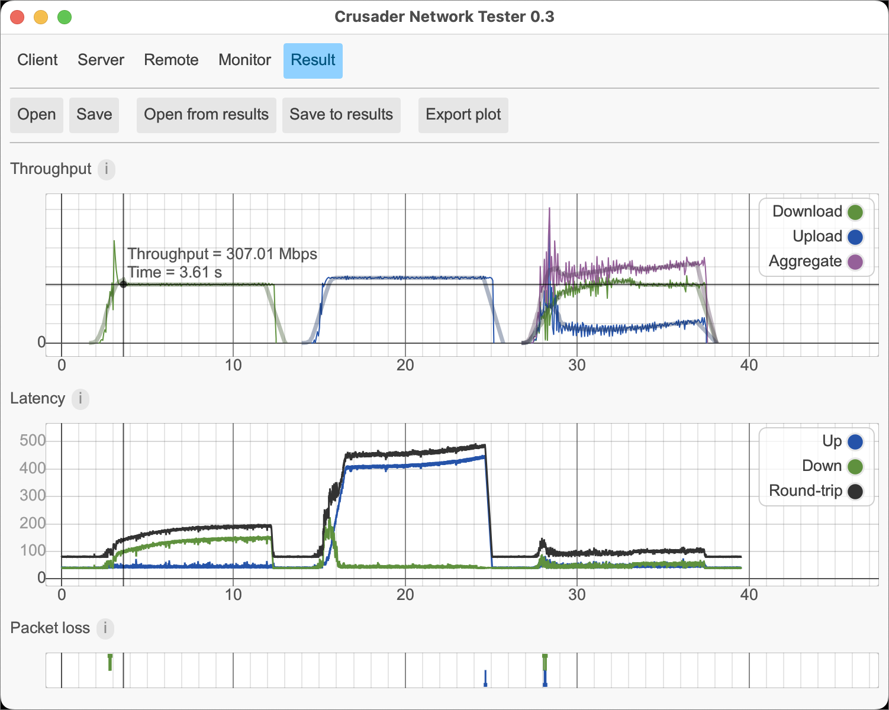
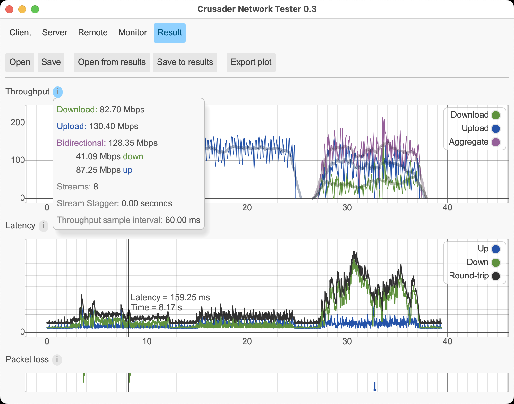
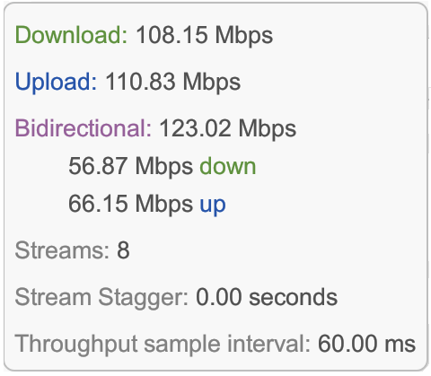
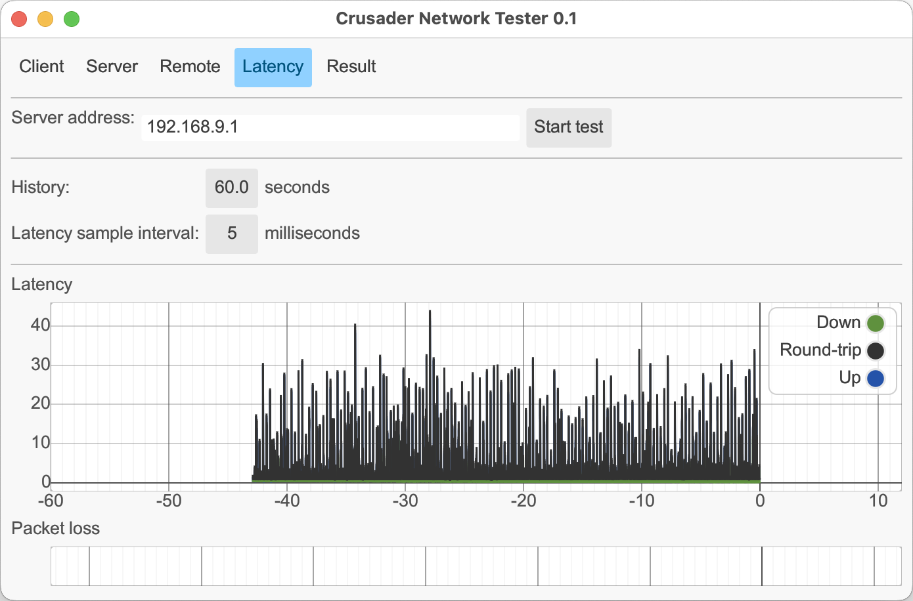
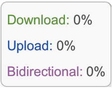

# Verify Crusader Screen Shots

This page is useful for checking the appearance of screen shots.
Capture the screen shots (Cmd-Shift-5 on macOS) and save with filenames
like "Client.png", "Server.png", etc., one for each of the tabs.

Run the `batch_add_border.sh` script - it finds all these files,
removes the drop shadow and adds "Crusader-" to each result file.

Remove the original files before committing to git.

## Client

## Server

## Remote

## Monitor

## Result

## Result with stats

## Throughput popup

## Latency popup

## Packet loss popup

