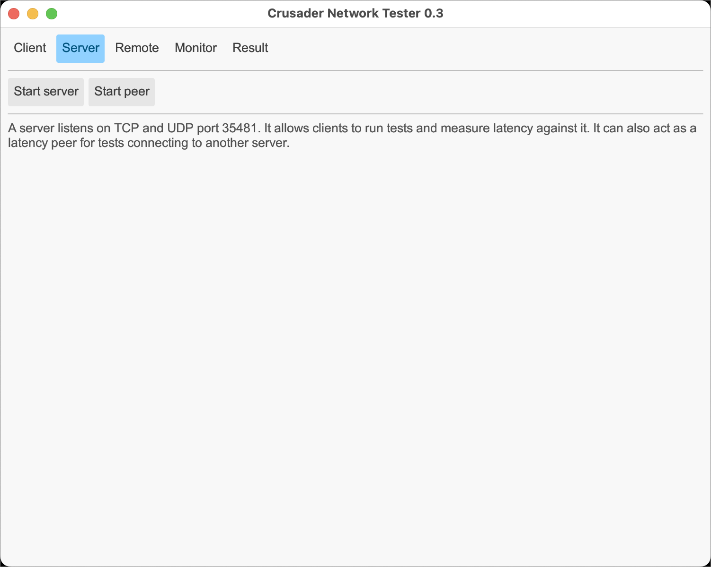
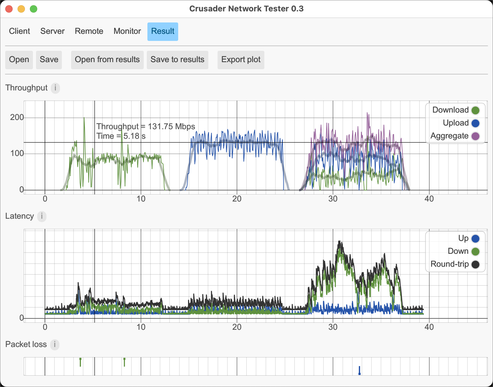

# Crusader Screen Shots

I use this page to check the appearance of the screen shots.
The process I use is to get an image (screen shot) then
trim off the drop shadow that the Mac captures.
I then save the image in the _media_ directory.
This page lets me ensure that the image retains the window border,
but not the additional drop shadow.
(See the current README that has the distracting drop shadow
that I now trim off.)

## Client

## Server

## Remote

## Monitor

## Result

