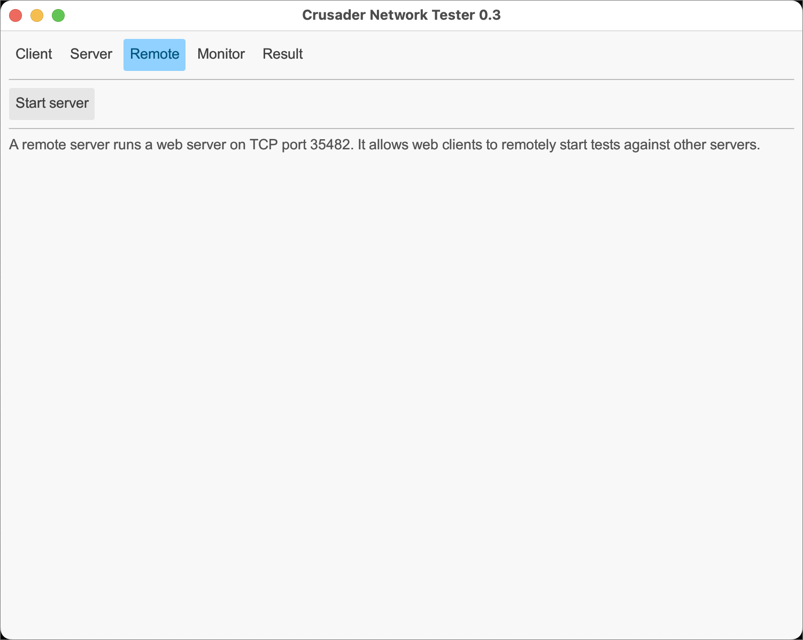

# Crusader Screen Shots

This page is useful to check the appearance of the screen shots.
Use this process: get an image (screen shot) then
trim off the drop shadow that the Mac captures.
Then save the image in the _media_ directory.
This page helps verify that the image retains the window border,
but not the additional drop shadow.

## Client

## Server

## Remote

## Monitor

## Result

